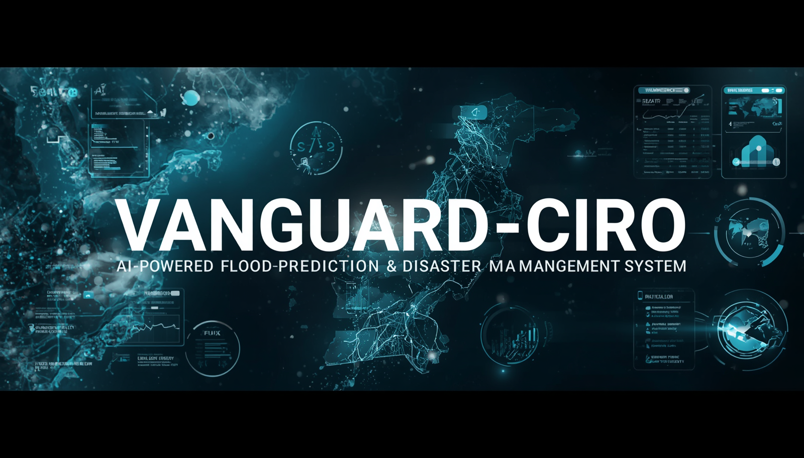

##  Project Demo

> **Click the image below to watch the complete demo video of Vanguard-CIRO.**
<div align="center">
<a href="https://drive.google.com/file/d/1vJ1LTkq26Bl7PByj-wfubU7skSev2-G6/view?usp=sharing">
  
</a>
</div>

# Run and deploy your AI Studio app

This contains everything you need to run your app locally.

View your app in AI Studio: https://vanguard-ciro-268969262451.us-central1.run.app/

## Run Locally

**Prerequisites:**  Node.js (v18+)

1. **Install dependencies:**
   ```bash
   npm install
   ```

2. **Configuration:**
   - Create a `.env` file (see `.env.example`).
   - Add your `GEMINI_API_KEY`.

3. **Run the app:**
   ```bash
   npm run dev
   ```
   Open [http://localhost:3000](http://localhost:3000) in your browser.

---
*Built for AI Seekho 2026.*

